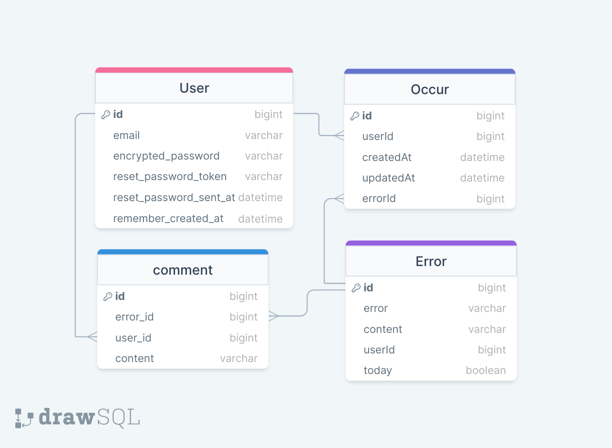

# ErrorToday

Calculate and shows most occured error during last 1 day.

## How to Run

- Bundle Install

```
bundle install
```

- Run Server

```
bin/rails server
```

- Register Cron Job

```
whenever --update-crontab
```

## ERD


